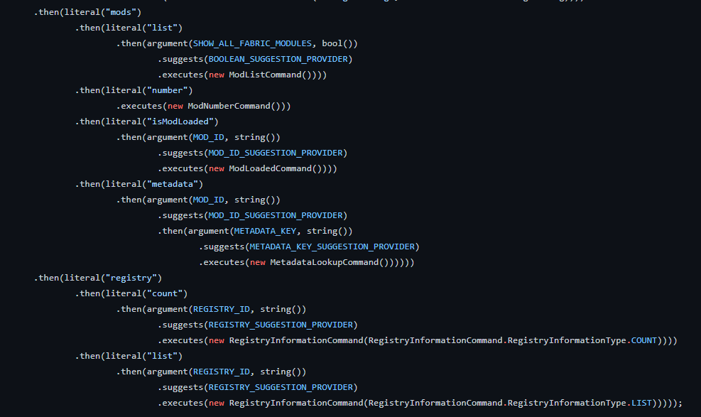

# Introduction to Commands

Minecraft uses [Brigadier ](https://github.com/Mojang/brigadier)to parse and execute its commands. Brigadier is described as a 'command parser and despatcher' and can be used in projects outside of Minecraft.

While creating commands can seem overwhelming at first, well maintained and formatted command registration becomes easy to read after a short period of working with commands. Static imports allow your code to be more readable when working with commands.&#x20;

